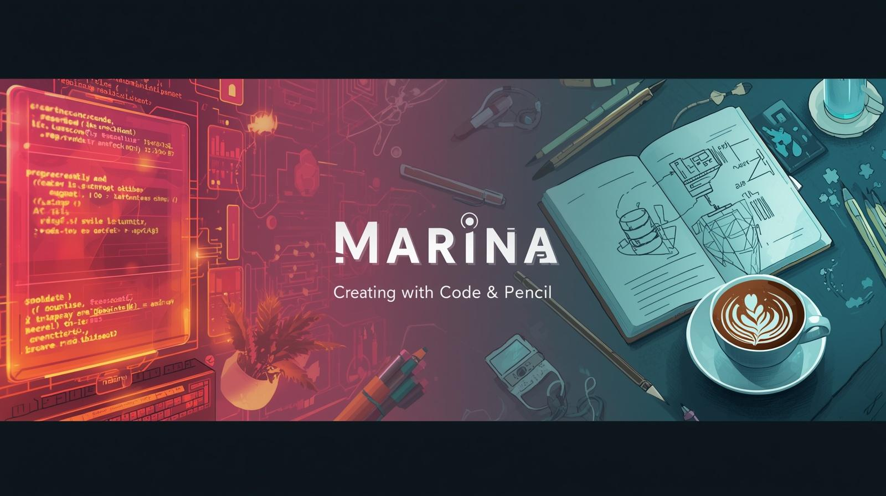

<!--
**mbs75/mbs75** is a ✨ _special_ ✨ repository because its `README.md` (this file) appears on your GitHub profile.

Here are some ideas to get you started:

- 🔭 I’m currently working on ...
- 🌱 I’m currently learning ...
- 👯 I’m looking to collaborate on ...
- 🤔 I’m looking for help with ...
- 💬 Ask me about ...
- 📫 How to reach me: ...
- 😄 Pronouns: ...
- ⚡ Fun fact: ...
-->

  

# ¡Buenas! Soy Marina 

## Sobre mí

Soy una estudiante de **primer curso de Desarrollo de Aplicaciones Web (DAW)**. Me fascina la tecnología y decidí adentrarme en este mundo motivada por sus excelentes perspectivas laborales y mi deseo de constante aprendizaje.

Mi objetivo a largo plazo es fusionar el desarrollo web con el mundo del **Big Data y la Inteligencia Artificial**, un camino que planeo iniciar cursando la especialización de mi futuro Grado en Economía. Mientras tanto, estoy construyendo una base técnica sólida.

---

## Mi Stack Tecnológico Actual (En Aprendizaje)

Aquí puedes ver las tecnologías con las que estoy trabajando día a día en clase:

  
  
  
  
  
  
  
  
  

### Mis Próximos Pasos

* [ ] Profundizar en programación orientada a objetos con Java.
* [ ] Modelar bases de datos complejas con SQL.
* [ ] Crear mis primeros proyectos web personales.
* [ ] Mantener el foco hacia la futura especialización en IA/Big Data.

---

---

##  Fuera de la Pantalla: Crear es mi Pasión

Cuando no estoy escribiendo código o diseñando bases de datos, me encontrarás alimentando mi lado creativo. Me apasiona el proceso de **elaborar y dar forma a nuevas ideas**.

*  **Cocina & Sabores:** Me encanta preparar **comida mediterránea**, de esa que reconforta el alma, aunque siempre dejo espacio para la aventura **probando recetas internacionales**. Para mí, explorar una nueva especia o técnica es como aprender una nueva librería: ¡abre un mundo de posibilidades!
*  **El Dibujo:** Estoy retomando las bases del dibujo a lápiz. Es mi forma favorita de practicar la paciencia, el detalle y la observación fuera del entorno digital.

  

---
---

##  Estadísticas de GitHub

  
  

---

## ¿Dónde Encontrarme?

Para cualquier colaboración o simplemente para hablar sobre código, IA o repostería:

* **GitHub:** Estás en el lugar correcto. ¡Échale un ojo a mis repositorios!

*(Nota: Como pediste, solo se incluye GitHub. Si en el futuro tienes LinkedIn o Portfolio, ¡puedes añadirlos aquí!)*
